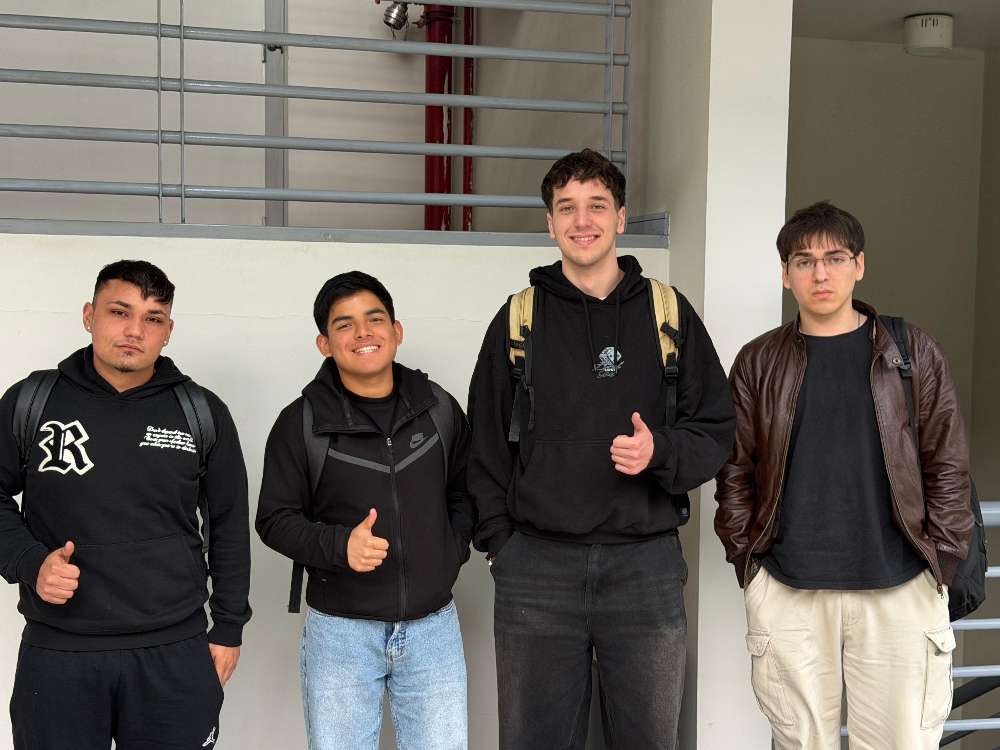

# S02 - Identidad del equipo y desafío

**Fecha:** 20.08.2026  
**Participantes:** Piero Valdivia Meneses, Marco Díaz Estrada, José Obrecht Egaña y Paulo García Arce.  
**Lugar:** Universidad Mayor.

## Objetivo de la sesión

Construir la identidad del equipo, acordar una forma de trabajo y realizar una primera interpretación del Desafío 05 de Capstone: Sostenibilidad, centrado en la circularidad y manejo de residuos de fabricación digital.

## Foto del equipo

## Nombre del equipo

**Nombre:** EcoFab Lab

### ¿Por qué lo elegimos?

El nombre EcoFab Lab representa la relación entre sostenibilidad y fabricación digital. Como equipo buscamos analizar un problema real relacionado con los residuos generados en procesos de fabricación digital y desarrollar una alternativa que pueda ser aplicada de manera realista en el contexto del Lab881.

## Integrantes y roles iniciales

| Integrante | Carrera o especialidad | Rol inicial | Aporte esperado |
|---|---|---|---|
| José Obrecht Egaña | Ingeniería Civil Industrial  | Coordinación y seguimiento | Coordinar las actividades, organizar reuniones, registrar acuerdos y realizar seguimiento de los avances. |
| Marco Díaz Estrada | Ingeniería Civil en Computación e Informática | Investigación y diagnóstico | Investigar el flujo de residuos seleccionado, recopilar antecedentes y apoyar la cuantificación del problema. |
| Piero Valdivia Meneses | Ingeniería Civil en Computación e Informática | Diseño y prototipado | Participar en la generación de alternativas, diseño de la solución y desarrollo del prototipo o procedimiento. |
| Paulo García Arce | Ingeniería Civil en Computación e Informática | Documentación y análisis | Organizar evidencias, datos y resultados, mantener la bitácora y apoyar el análisis del proyecto. |

## Valores del equipo

Durante nuestra primera reunión acordamos que los principales valores que guiarán nuestro trabajo serán:

- Respeto.
- Responsabilidad.
- Comunicación.
- Compromiso.
- Colaboración.
- Proactividad.
- Creatividad.
- Sostenibilidad.

Estos valores permitirán mantener una dinámica de trabajo donde todos podamos participar, aportar ideas y asumir responsabilidades.

## Normas

1. **Puntualidad y asistencia:** Los integrantes deberán respetar los horarios acordados y avisar con anticipación si no pueden asistir.
2. **Reparto equilibrado de tareas:** Las actividades se distribuirán procurando que todos los integrantes tengan una participación efectiva.
3. **Cumplimiento de plazos:** Cada integrante deberá cumplir los compromisos acordados y comunicar oportunamente cualquier dificultad.
4. **Respeto:** Todas las opiniones serán escuchadas y los desacuerdos se abordarán mediante crítica constructiva.
5. **Comunicación:** Se utilizarán los canales acordados para mantener informado al equipo sobre avances y problemas.
6. **Revisión previa:** Los entregables serán revisados por el equipo antes de su presentación.
7. **Registro:** Las decisiones, avances y evidencias importantes serán incorporados a la bitácora.
8. **Resolución de conflictos:** Los problemas se conversarán primero entre los integrantes y, si no existe acuerdo, se solicitará orientación al docente.

## Canales de comunicación

- **WhatsApp:** coordinación rápida y comunicación diaria.
- **Presencial / horario de clases:** reuniones y trabajo colaborativo.
- **GitHub:** almacenamiento de la bitácora, evidencias y documentación del proyecto.

## Mecanismos de resolución de conflictos

- Si un integrante no puede cumplir una tarea, deberá avisar oportunamente.
- Las decisiones relevantes serán conversadas entre todos.
- Se buscará llegar a acuerdos mediante consenso.
- En caso de no alcanzar un acuerdo, se solicitará orientación a la docente.
- Los problemas se abordarán sobre la base de los valores y normas definidos por el equipo.

## Primera definición del desafío

El equipo trabajará en el **Desafío 05 | Sostenibilidad: Circularidad y manejo de residuos de fabricación digital**, asociado a la Municipalidad de Providencia / Hub Providencia - Lab881.

### Pregunta orientadora

> ¿Cómo podríamos reducir, reutilizar o reciclar los residuos plásticos derivados del uso de máquinas de impresión 3D y resina en el Lab881 de Providencia?

### Lo que sabemos

La fabricación digital genera diferentes residuos, entre ellos filamentos, soportes, piezas defectuosas, residuos de resina y otros materiales.

El PLA ya es gestionado mediante un convenio con REBASE, por lo que el desafío debe concentrarse en flujos que presentan mayores dificultades, especialmente los residuos de impresión 3D con resina y los residuos asociados a la cortadora láser.

### Lo que todavía no sabemos

- Qué flujo específico presenta actualmente la mayor dificultad.
- Cuánto residuo se genera y con qué frecuencia.
- Cómo se realiza actualmente la segregación y almacenamiento.
- Qué alternativas podrían ser técnicamente viables.
- Qué requisitos de seguridad, operación y gestión de residuos deben considerarse.

### Definición del desafío

Como equipo EcoFab Lab abordaremos la gestión de residuos derivados de procesos de fabricación digital en el Lab881.

La primera etapa será seleccionar y cuantificar un flujo de residuos que presente dificultades de manejo. Posteriormente analizaremos alternativas de reducción, segregación, reutilización, valorización o gestión segura, para finalmente desarrollar un prototipo, procedimiento o piloto que permita demostrar la alternativa recomendada.

## Usuarios y beneficiarios

Los principales beneficiarios identificados son:

- Equipo operador del Lab881.
- Personas usuarias del laboratorio.
- Gestores de residuos.
- Comunidad relacionada con la fabricación digital.

## Solución que se busca explorar

Inicialmente exploraremos una solución que permita intervenir el flujo de residuos seleccionado en uno o más puntos del proceso: generación, separación, almacenamiento, reutilización, valorización o gestión segura.

La alternativa definitiva será seleccionada después del diagnóstico, considerando su factibilidad técnica, compatibilidad con el funcionamiento real del Lab881 y capacidad de demostrar una mejora respecto de la situación actual.

## Objetivo SMART del equipo

Diseñar y validar, antes de la entrega final del proyecto, una alternativa técnicamente viable para reducir la generación o mejorar la segregación, reutilización, valorización o gestión segura de un flujo de residuos de fabricación digital del Lab881, utilizando un diagnóstico cuantificado y desarrollando un prototipo, procedimiento o piloto que permita demostrar su potencial de mejora respecto de la situación actual.

## Compromisos individuales SMART

| Integrante | Compromiso | SMART | Plazo |
|---|---|---|---|
| José Obrecht Egaña | COORDINACIÓN Y SEGUIMIENTO | Me comprometo a coordinar el trabajo del equipo, registrar acuerdos, responsables y fechas, y realizar seguimiento semanal de los compromisos para mantener actualizado el avance del proyecto. | Primeras etapas del proyecto |
| Marco Díaz Estrada | INVESTIGACIÓN Y DIAGNÓSTICO | Me comprometo a investigar y caracterizar el flujo de residuos seleccionado, recopilando información que permita construir un diagnóstico cuantificado y detectar oportunidades de mejora. | Primeras etapas del proyecto |
| Piero Valdivia Meneses | DISEÑO Y PROTOTIPADO | Me comprometo a participar en la generación y selección de alternativas y desarrollar, junto al equipo, un prototipo o procedimiento que permita demostrar la factibilidad técnica de la propuesta antes de la entrega final. | Desarrollo del proyecto |
| Paulo García Arce | DOCUMENTACIÓN Y ANÁLISIS | Me comprometo a organizar datos, fotografías, evidencias y resultados, manteniendo actualizada la bitácora y apoyando el análisis comparativo de la situación actual y la solución propuesta. | Durante todo el proyecto |

## Compromiso del equipo

Como equipo EcoFab Lab, nos comprometemos a trabajar colaborativamente para comprender y abordar un problema real de residuos de fabricación digital en el Lab881.

Nos comprometemos a fundamentar nuestras decisiones mediante evidencia, mantener una comunicación constante, cumplir las tareas acordadas y desarrollar una solución que sea técnicamente viable y compatible con el funcionamiento real del laboratorio.

## Horarios y rutinas de trabajo

El trabajo se desarrollará principalmente durante el horario de clases, complementándolo con coordinaciones asincrónicas cuando sea necesario.

## Coordinaciones puntuales

Se utilizará WhatsApp para coordinaciones rápidas y GitHub para mantener organizada la documentación, evidencias y bitácora del proyecto.

## Reflexión breve

### ¿Qué fue fácil?

Fue posible llegar rápidamente a un acuerdo sobre la importancia de trabajar colaborativamente y sobre la necesidad de abordar el problema desde una perspectiva de sostenibilidad y fabricación digital.

### ¿Qué fue difícil o generó desacuerdo?

El principal desafío inicial es determinar qué flujo específico de residuos debe ser estudiado, ya que existen diferentes tipos de residuos asociados a los procesos de fabricación digital.

### ¿Qué necesitamos resolver en la próxima sesión?

Necesitamos profundizar en el diagnóstico del Lab881, identificar el flujo de residuos que será estudiado y comenzar a recopilar datos que permitan cuantificar el problema antes de definir una solución.
