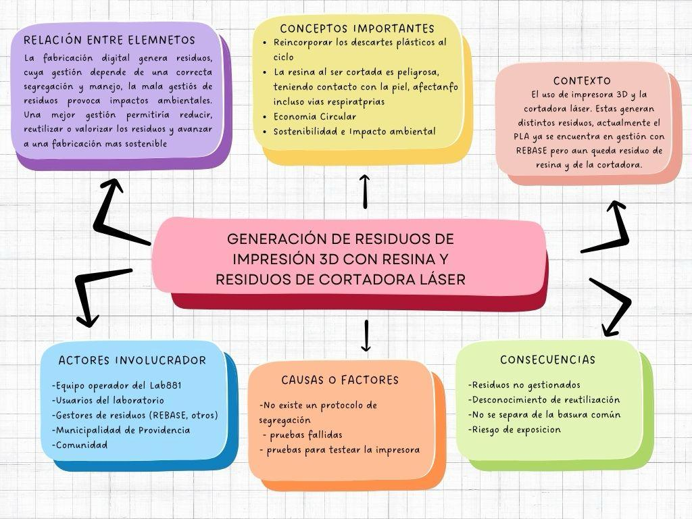
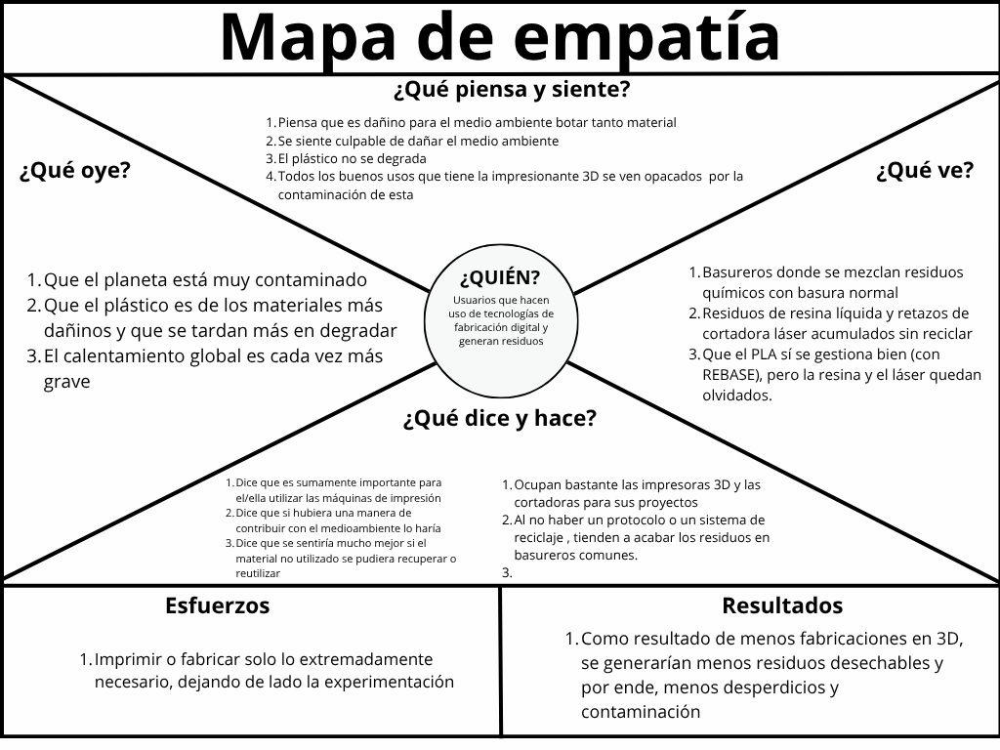

# S02 - Identidad del equipo y desafío

**Fecha:** 27.08.2026  
**Participantes:** Piero Valdivia Meneses, Marco Díaz Estrada, José Obrecht Egaña y Paulo García Arce.  
**Lugar:** Universidad Mayor.

## Objetivo de la sesión

Construir un mapa conceptual y un mapa de Empatía, en base a los residuos de resina de impresora 3D y cortadora láser.

## Mapa Conceptual

## Mapa de Empatía

